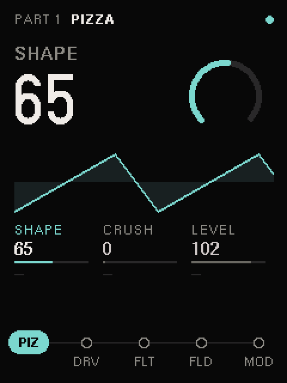
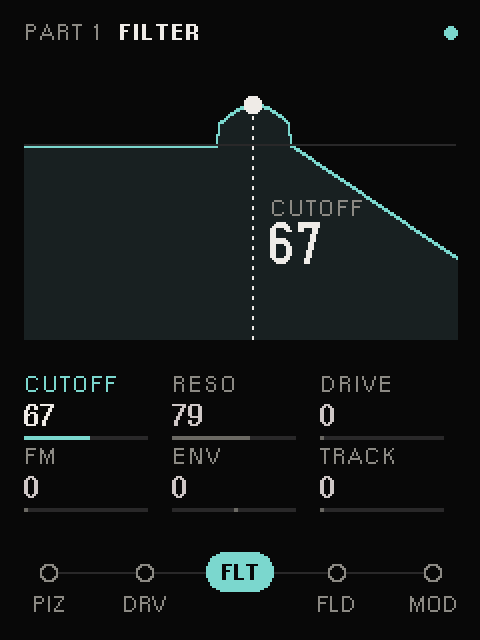
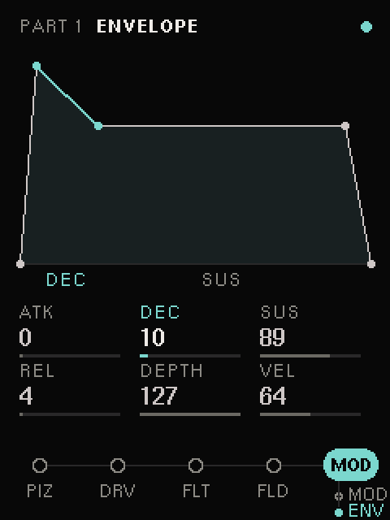
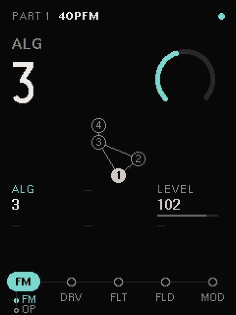
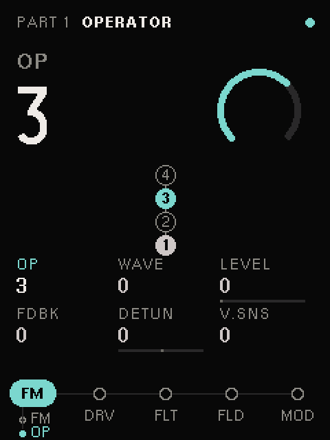
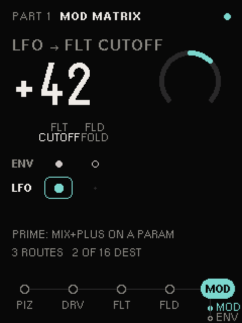
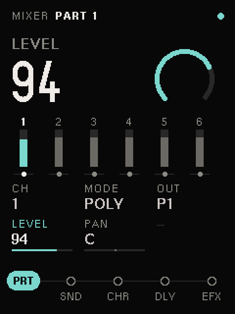
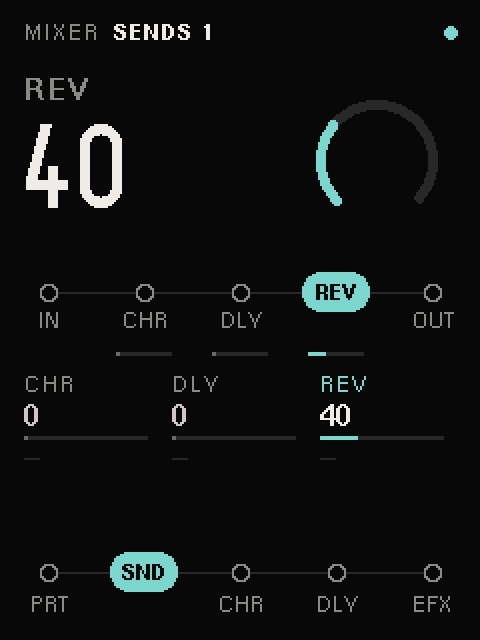
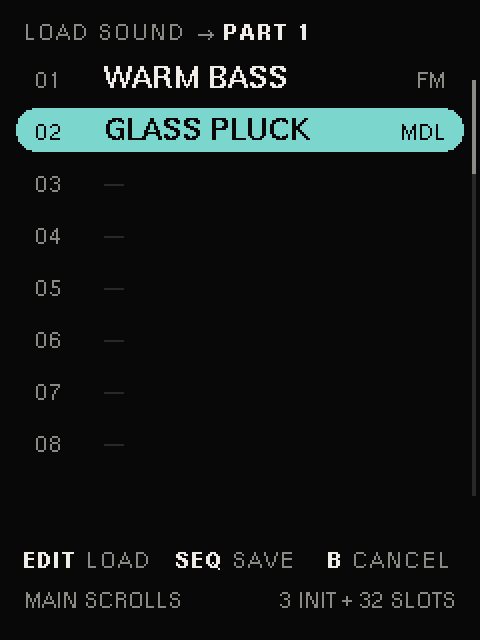

# Chimera (Work in progress)

Multi-engine digital synthesizer firmware for PreenFM3.

Three engines. One beast.

## Screens

Rendered by the firmware's own renderer (`chimera-core`) at the display's native 240×320, shown at 2×. Regenerate with `just screens` after any UI change.

| Engine (Pizza) | Filter | Envelope |
|---|---|---|
|  |  |  |

| FM algorithm | FM operator | Mod matrix |
|---|---|---|
|  |  |  |

| Mixer · Part | Mixer · Sends | Sound browser |
|---|---|---|
|  |  |  |

## Engines

- **4-op FM** — TX81Z style, Digitone ergonomics
- **Physical Modeling** — Karplus-Strong, modal resonators (MI Elements/Rings inspired)
- **VA Polymod** — Prophet-5 style, oscillator sync, cross-modulation

## Architecture

Custom Rust firmware replacing stock PreenFM3 firmware. Swappable synthesis engines feed a shared signal chain (drive -> filter -> wavefolder -> VCA). LSDJ-inspired chain navigation with dungeon-map position display.

## Building

Requires Rust nightly + `thumbv7em-none-eabihf` target for firmware, or just stable Rust for the desktop simulator.

```bash
# Desktop simulator
just desktop

# STM32 firmware
just firmware

# Flash to PreenFM3
just flash
```

## Status

Phase 0: Hardware bringup — in progress.
